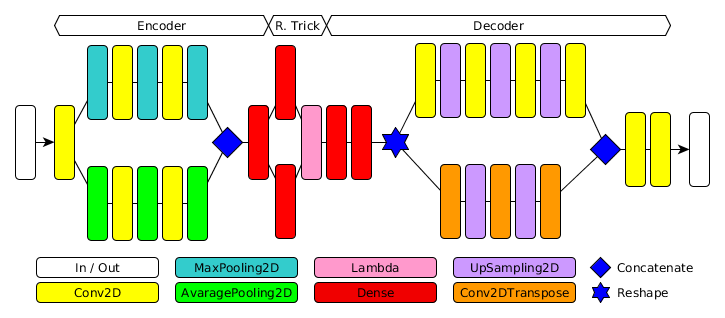
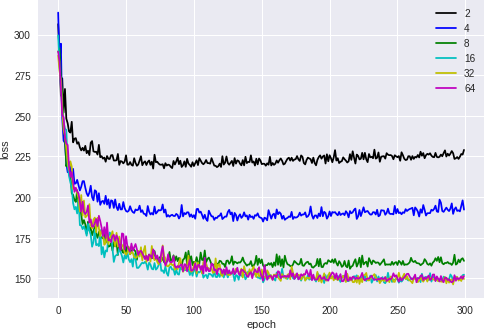
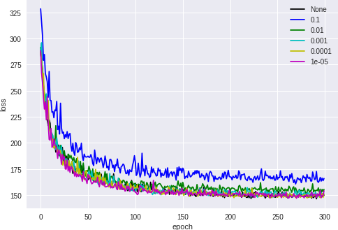
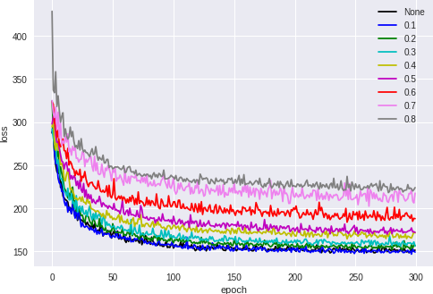
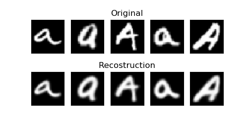

# Variational-AutoEncoder For Novelty Detection

# Abstract
Using a `Variational AutoEncoder`[1], the generation process of data will be learned.

Using `mean squared error`, the difference between original data and the reconstrued one will be calculated and used to determine a threshold.

That `threshold` will be used to discriminate the regular data from the novelties ones.

Finally the results will be compared with the `OneClass-SVM`[2].

# Dataset
For the dataset has been used `EMNIST-Letters`[3] a set of 26 balanced classes (from A to Z) composed by images with 28x28 pixels.

To simulate a novelty dataset has been added to the first class (A) some examples taken from the others classes to achieve about 3% of impurities both in Train set and Test set.

# Experiment Details
Has been trained different autoencoders changing :
- Reparametrization Trick sizes (see model bottom)
- L2 regularization values for convolutional and dense layers
- dropout values for dropout layers (see model.py)

The threshold has been chosen (in the Train set) from the ordered mean squared errors vector such that there are about 3% elements greater than the threshold.

### Model


## Results
### Reconstruction error by changing R. Trick size


### Reconstruction error by changing Regularization Values (R. Trick = 32)


### Reconstruction error by changing Dropout Values (R. Trick = 32, Regularization = 0.001)


### Best Reconstruction Losses
r. trick | reg. | dropout | loss  
-------- | ---- | ------- | ----
32 | 1e-05 | 0.1    | 144.07
32 | None | None | 144.09
32 | 0.0001 | 0.1   | 144.14
32 | 1e-05 |  None | 144.22
32 | 0.001 | 0.1 | 144.50

### Best Reconstruction Example (R. Trick = 32, Regularization = 1e-05, Dropout = 0.1)


### Best F1-Scores
r. trick | reg. | dropout | loss | precision | recall | f1-score 
-------- | ---- | ------- | ---- | --------- | ------ | --------
32 | 1e-05 | 0.5    |  181.39  |  0.983  |  0.993  |  0.988  
16 | 1e-05 | 0.7    |  190.79  |  0.983  |  0.991  |  0.987  
2 | 0.1 | 0.7      |  234.33  |  0.979  |  0.990  |  0.984  
2 | 0.001 | 0.5    |  213.25  |  0.980  |  0.988  |  0.984 
64 | 0.0001 | 0.6   |  194.82  |  0.980  |  0.988  |  0.984 

### Best OneClass-SVM
gamma |  Precision | recall | f1-score
----- |  --------- | ------ | --------
0.1   |    0.9664  | 0.8988 |  0.9313 

### Remarks
- Because of the random components in the process the result should be cross-validated.
- The model can represent a standard autoencoder, I don't have tested it.
- I trained the models in Google Colab and saved the results in Google Drive for speed up the process.

# Contents
```
helper/       : helper to recreate the experiment
imgs/         : images for this README
saved/        : best F1-score model weights
experiment.py : example to recreate experiment
indices.npy   : my indices 
results.npy   : my results
```

# Tools
- Python 3.6
- numpy 1.14.5
- Tensorflow 1.8.0
- Keras 2.1.6
- matplotlib 2.2.2
- sklearn 0.19.1

# References
- [1] [KINGMA, Diederik P.; WELLING, Max. Auto-encoding variational bayes. arXiv preprint arXiv:1312.6114, 2013.](https://arxiv.org/pdf/1312.6114.pdf)
- [2] [SCHÖLKOPF, Bernhard, et al. Estimating the support of a high-dimensional distribution. Neural computation, 2001, 13.7: 1443-1471.](https://www.mitpressjournals.org/doi/pdfplus/10.1162/089976601750264965)
- [3] [Cohen, G., Afshar, S., Tapson, J., & van Schaik, A. (2017). EMNIST: an extension of MNIST to handwritten letters](https://www.nist.gov/itl/iad/image-group/emnist-dataset)
